# CUDA Path Tracer

## Project Introduction

> University of Pennsylvania CIS5650 – GPU Programming and Architecture
> 
> - Jacky Park
> - Tested on: Windows 11, i9-13900H @ 2.60 32 GB, RTX 4070 (Laptop GPU) 8 GB (Personal Machine: ROG Zephyrus M16 GU604VI_GU604VI)

This project uses NVIDIA CUDA programming library to implement a GPU path tracer.

# Representative Outcome

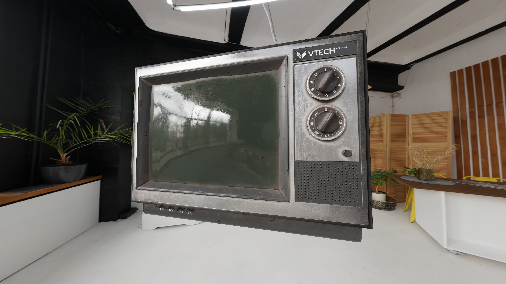
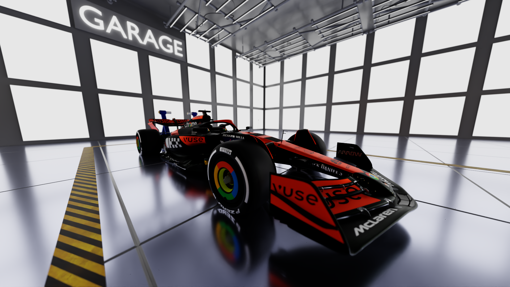

## Rendering Realism: Physically-Based Materials

### Diffuse (Lambertian)

An ideal **Lambertian** BRDF that scatters light uniformly over the hemisphere. Uses **cosine-weighted sampling** and an **energy-conserving** formulation; appropriate for perfectly rough, non-metal surfaces (matte paint, worn rubber).

### Metallic-Roughness (Microfacet PBR)

An artist-friendly workflow driven by **base color (albedo)**, **metallic**, **roughness**, and **normal** textures. The BRDF uses **Trowbridge–Reitz GGX** with **Smith** masking-shadowing and **Schlick** Fresnel. A **multiple-scattering energy compensation** step keeps rough conductors physically plausible so metals don’t go unnaturally dark at high roughness.

### **Dielectric (Transparent Insulators)**

A physically based model for glass, water, and clear plastics. It splits energy between reflection and refraction using Fresnel (Schlick) with a chosen index of refraction.

  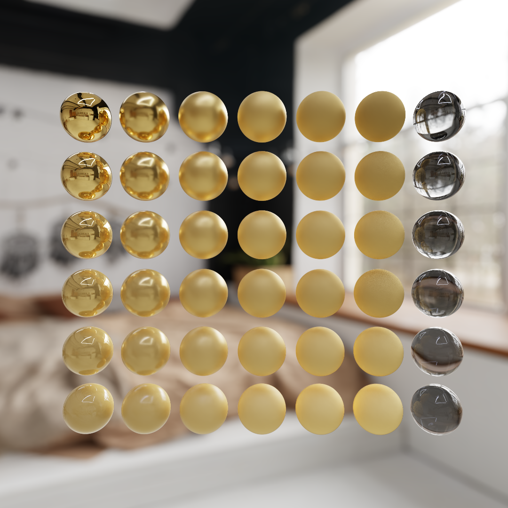

*metallic–roughness grid (metallic top→bottom, roughness left→right); rightmost column shows **dielectric** spheres with varying **index of refraction**.*

### Image-Based Lighting: HDR Environment Map

Lighting can make or break a scene, and hand-crafting it is time-consuming. **HDR environment maps (HDRIs)** are an image-based lighting shortcut: they capture real-world light and color, so the renderer can sample the map instead of terminating rays that miss geometry. This yields believable global illumination and a natural **background** with minimal setup. 

In this project, I use an equirectangular HDRI and sample it for radiance at the ray’s exit direction; it’s a simple way to get realistic lighting without manual light rigging.

<table align="center">
  <tr>
    <th>Fireplace (HDRI)</th>
    <th>Studio (HDRI)</th>
  </tr>
  <tr>
    <td>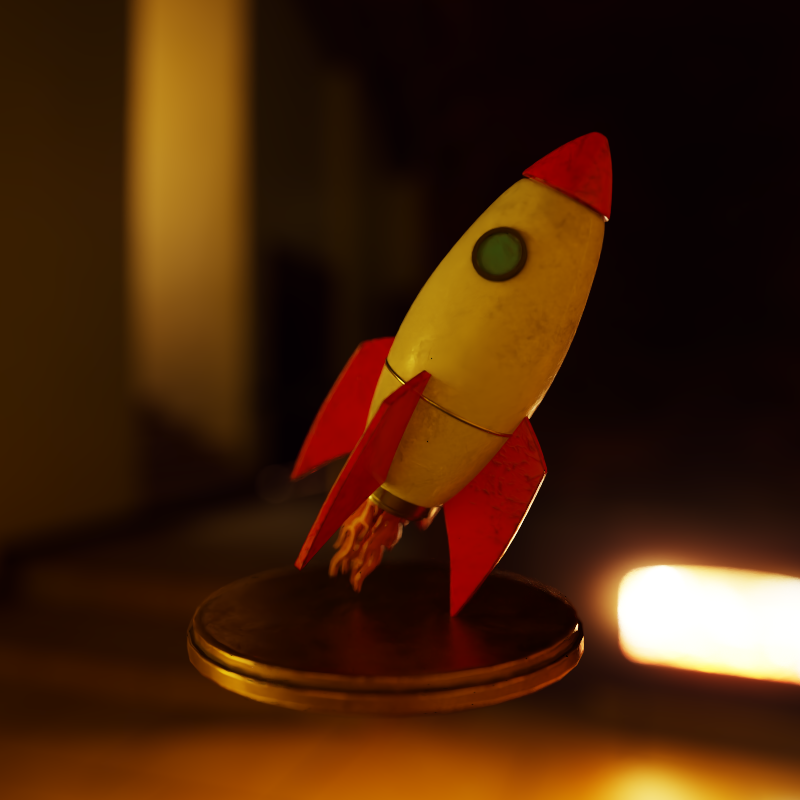</td>
    <td>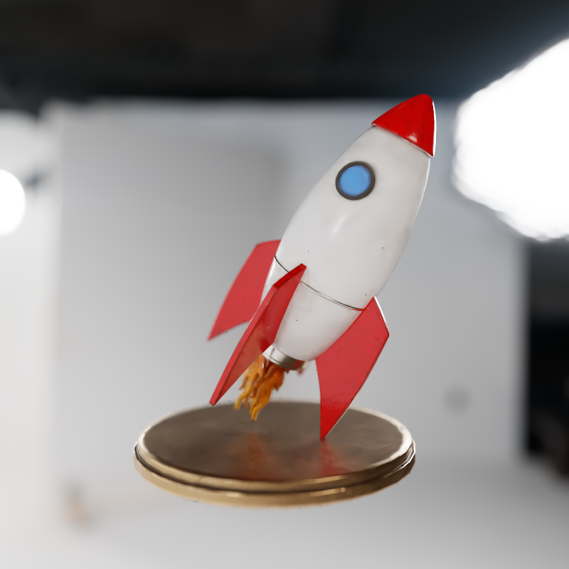</td>
  </tr>
</table>

### More Details!: Normal Map & PBR Texture

Modern asset pipelines ship multiple texture maps per model. **Normal maps** fake small-scale surface detail without adding geometry. **Metallic** and **Roughness** textures (from tools like Substance Painter) drive a physically based **metallic-roughness** workflow for realistic materials.

In this project, these maps come from **glTF**, get uploaded to the GPU, and are sampled during shading. 

For inspection, I output **AOVs (Arbitrary Output Variables) -** e.g., **Albedo**, **Normal**, **Roughness**, **Metallic**. These views are great for debugging and also serve as guides for the denoiser discussed later.

<table align="center" width="70%">
  <tr>
    <th colspan="2" style="text-align:center;">
      
Beauty

      
    </th>
  </tr>
  <tr>
    <th>Albedo</th>
    <th>Normal</th>
  </tr>
  <tr>
    <td>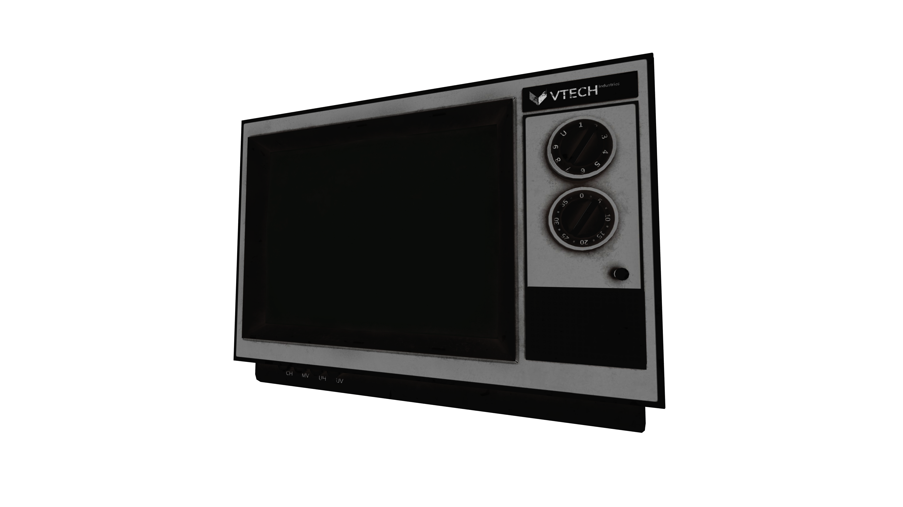</td>
    <td>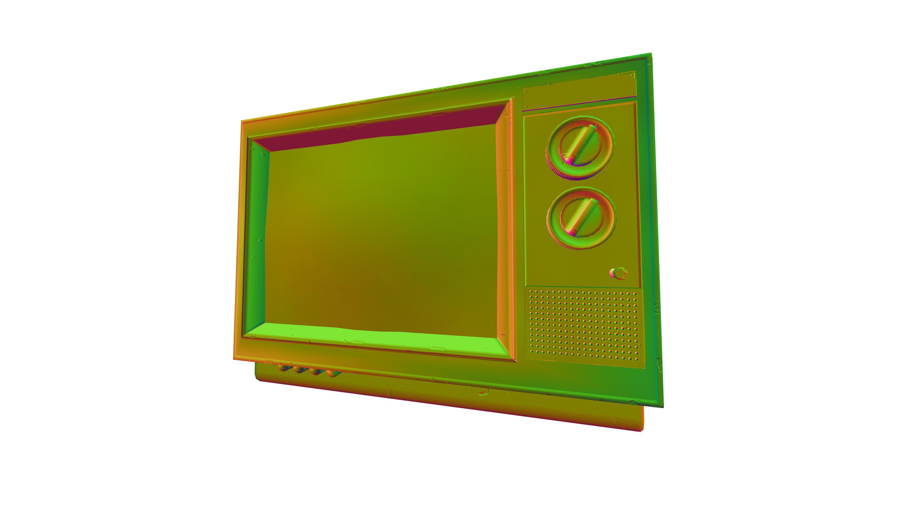</td>
  </tr>
  <tr>
    <th>Metallic</th>
    <th>Roughness</th>
  </tr>
  <tr>
    <td>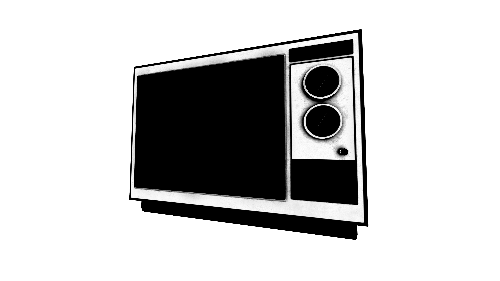</td>
    <td>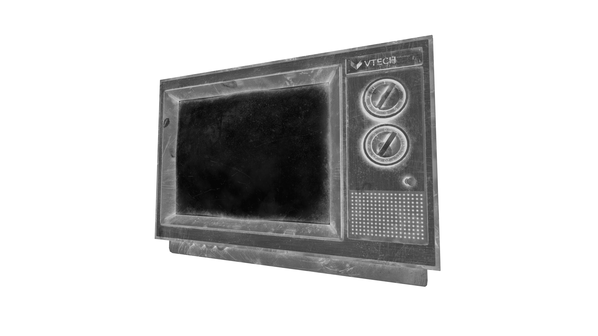</td>
  </tr>
</table>

### Physically-Based Camera: Depth of Field
A pinhole camera keeps everything razor-sharp, which isn’t how real cameras behave. Real lenses have a focus distance and an aperture, so subjects on the focus plane look crisp while others blur, a classic depth of field you see in film and photography. To achieve this effect, I use a thin-lens shortcut: instead of firing every ray from one point, I sample a random point on a lens disk (size = aperture) and aim at a focus point set by the focus distance. 

It delivers natural, camera-like blur and bokeh with minimal setup: open the aperture for more blur, stop down for less.
<table align="center">
  <tr>
    <th>DOF Enabled</th>
    <th>DOF Disabled</th>
  </tr>
  <tr>
    <td>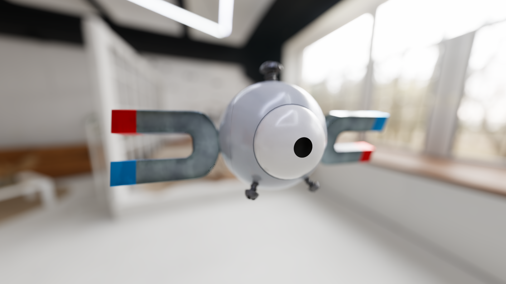</td>
    <td>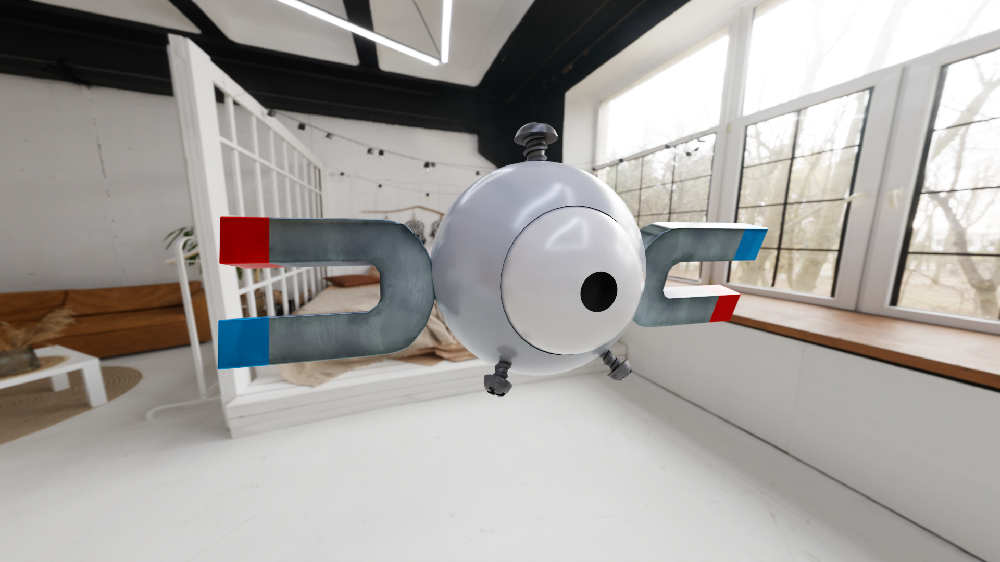</td>
  </tr>
</table>

### Correct Colors: Image Pre/Post Processing
Color management is an integral part of the rendering pipeline. It includes converting texture inputs into a **linear** rendering space and converting the final image into the correct **display** space. The article linked [here](https://kinematicsoup.com/news/2016/6/15/gamma-and-linear-space-what-they-are-how-they-differ) illustrates why using the correct color space matters, but in short: for physically correct light transport, all color data must be in **linear** space, where numeric values scale proportionally with radiometric energy.

  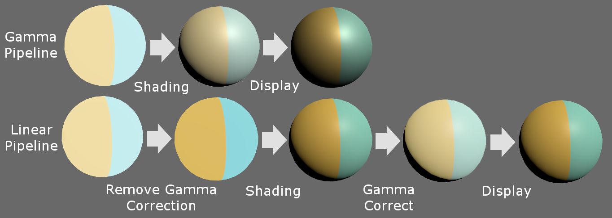

*A side-by-side comparison of a scene shaded with a proper linear workflow versus one shaded in gamma space. The linear workflow preserves accurate light addition and material response, while the non-linear workflow shows incorrect brightness, washed-out highlights, and skewed color relationships. [(Image credit)](https://kinematicsoup.com/news/2016/6/15/gamma-and-linear-space-what-they-are-how-they-differ)*

My renderer works in **sRGB - Linear** color space for shading. Texture images are converted from sRGB to linear on import; the final frames are **ACES** tone-mapped and **gamma-corrected** for display. In the future, a dedicated color-management library like **OpenColorIO (OCIO)** could be integrated to make the path tracer more robust and configurable.

<table align="center">
  <tr>
    <th>No Post-Process</th>
    <th>Post-Process</th>
  </tr>
  <tr>
    <td>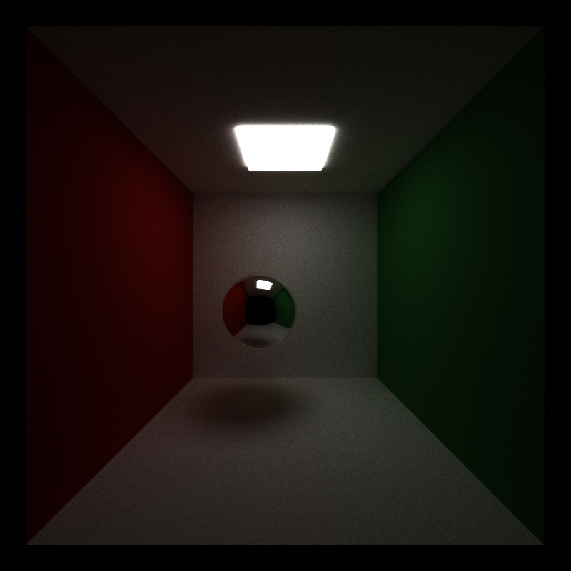</td>
    <td>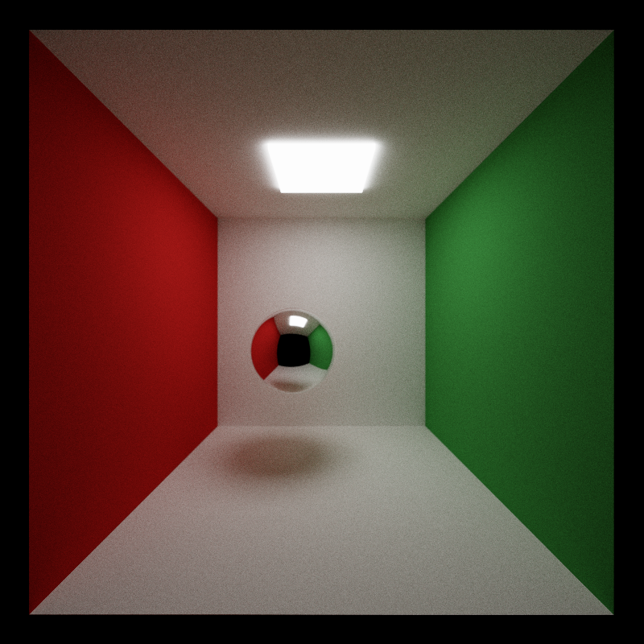</td>
  </tr>
</table>

### Stochastic Anti-aliasing
So far, each camera ray was aimed at the exact center of its pixel. This regular sampling is prone to aliasing, which shows up as jagged edges and shimmering on high-frequency detail (see image 1). The fix is simple: stochastic anti-aliasing. Jitter the ray’s target within the pixel footprint so each iteration samples a slightly different sub-pixel position, then average those samples over many iterations to approximate the pixel’s true integral and smooth edges.

In practice, the benefit is most obvious on perfectly specular materials. With center-only sampling, rays launch in the same direction, reflect in the same direction, and accumulate the same radiance, so specular highlights and edges alias badly. Jittered sampling decorrelates those paths, produces varied sub-pixel samples, and yields a much cleaner, more stable result after averaging.

<table align="center">
  <tr>
    <th>AA Enabled</th>
    <th>AA Disabled</th>
  </tr>
  <tr>
    <td>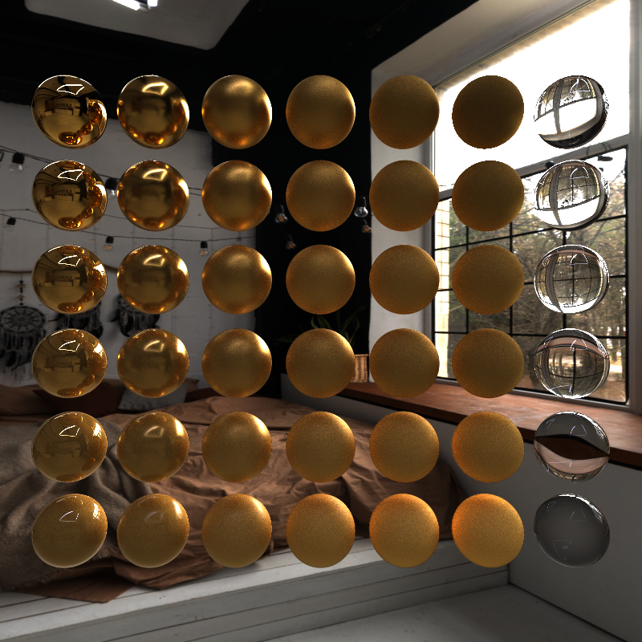</td>
    <td>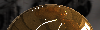</td>
  </tr>
</table>

### NVIDIA OptiX AI Denoising 
So we spent a long time rendering, but there is still noise and fireflies in the scene (ouch!). How can we further improve the quality of the render? The usual next step is denoising, and for this project I tried NVIDIA OptiX since I am on NVIDIA hardware and want to get some value out of the $$$ GPU. 

The OptiX AI denoiser cleans up Monte Carlo noise so low-spp frames become usable much sooner, taking the noisy beauty pass and using albedo and normal AOVs as guides to preserve broad color regions and surface edges while smoothing speckle. In my tests it is strongest on diffuse surfaces where the signal is low frequency and the guides align with the final look. The downsides are clear: high-frequency detail from roughness variation or fine albedo texture can get smudged, especially at small resolutions. Rendering at higher resolutions like 2K or 4K helps a bit because textures resolve more cleanly before denoising. Overall it is a great productivity tool, but I keep a higher-spp or higher-res reference for shots with lots of micro detail.

<table align="center">
  <tr>
    <th>Original Image</th>
  </tr>
  <tr>
    <td></td>
  </tr>
  <tr>
    <th>Denoised Image</th>
  </tr>
  <tr>
    <td>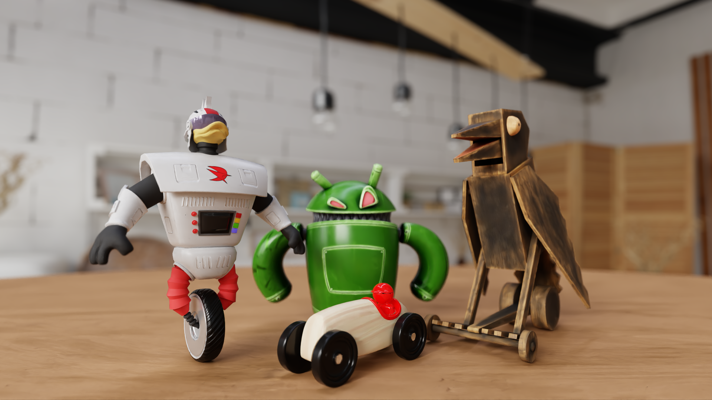</td>
  </tr>
</table>

## Performance
### Stream Compaction
The basic loop in a path tracer shoots paths from the camera: one per pixel. On the first iteration we launch width × height threads (one thread per path). After the first bounce, some paths may escape to the environment or terminate for other reasons (Russian roulette, absorption, etc.). From that point on, launching the full thread count wastes work.

A simple optimization is **stream compaction**: after each bounce, remove “dead” paths from the work list so the next kernel launch uses exactly the number of still-alive paths. In this path tracer, we compact by splitting live and dead paths each iteration with `thrust::partition`. This introduces overhead in lockstep, so it only pays off when a substantial fraction of paths have already terminated. 

<table align="center">
  <tr>
    <th>Open Scene</th>
    <th>Closed Scene</th>
  </tr>
  <tr>
    <td>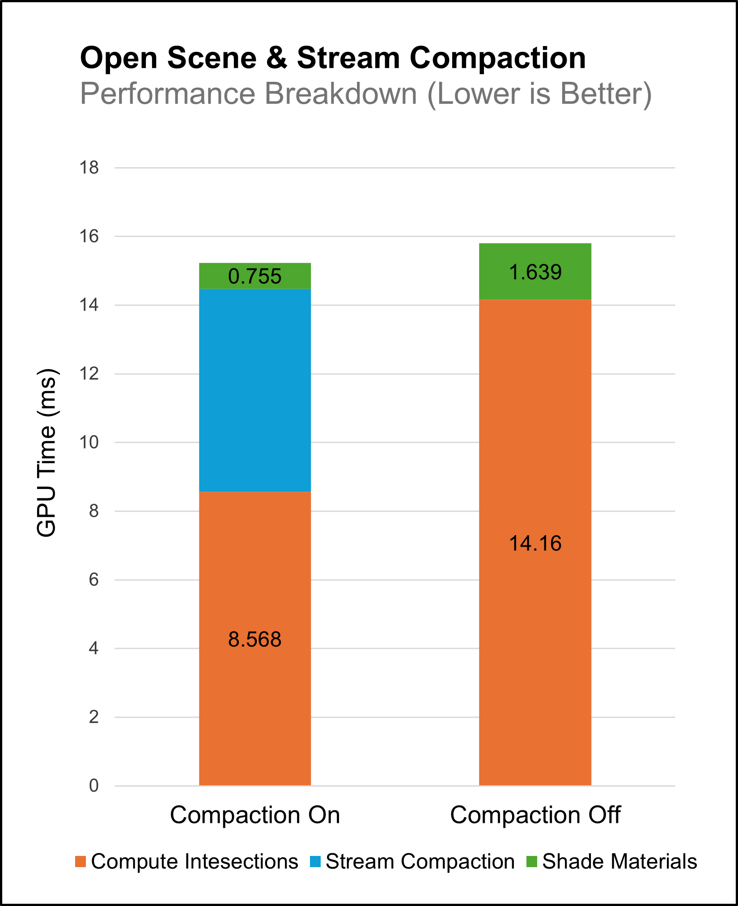</td>
    <td>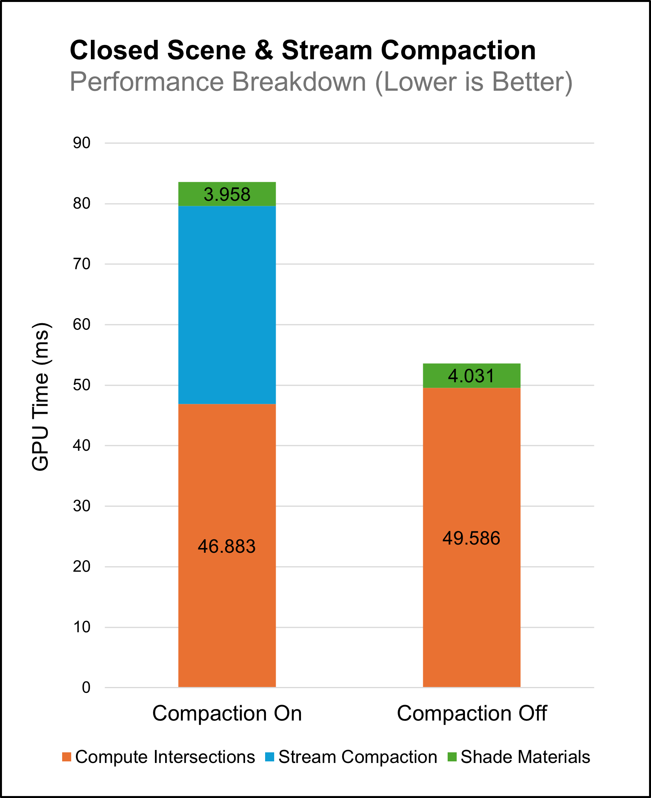</td>
  </tr>
</table>

The graph above shows this effect: as the dead-ray percentage rises (in the open scene), total render time drops faster than the compaction overhead grows, yielding a net speedup; when survival stays high, compaction can hurt.

### Material Sorting
As another optimization, I implemented material-based sorting. Specifically, I sort active paths by their intersected material type (e.g., PBR, diffuse, dielectric) using `thrust::sort_by_key`, then launch a separate kernel per material group. The idea is to use smaller, specialized kernels (one material per kernel) instead of a mega-kernel, which should reduce branch divergence and improve cache/memory coherence.

<table align="center">
  <tr>
    <th>Test Scene</th>
    <th>Test Result</th>
  </tr>
  <tr>
    <td>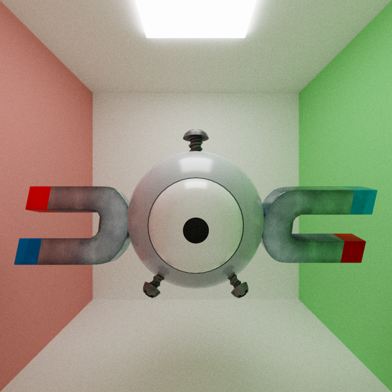</td>
    <td>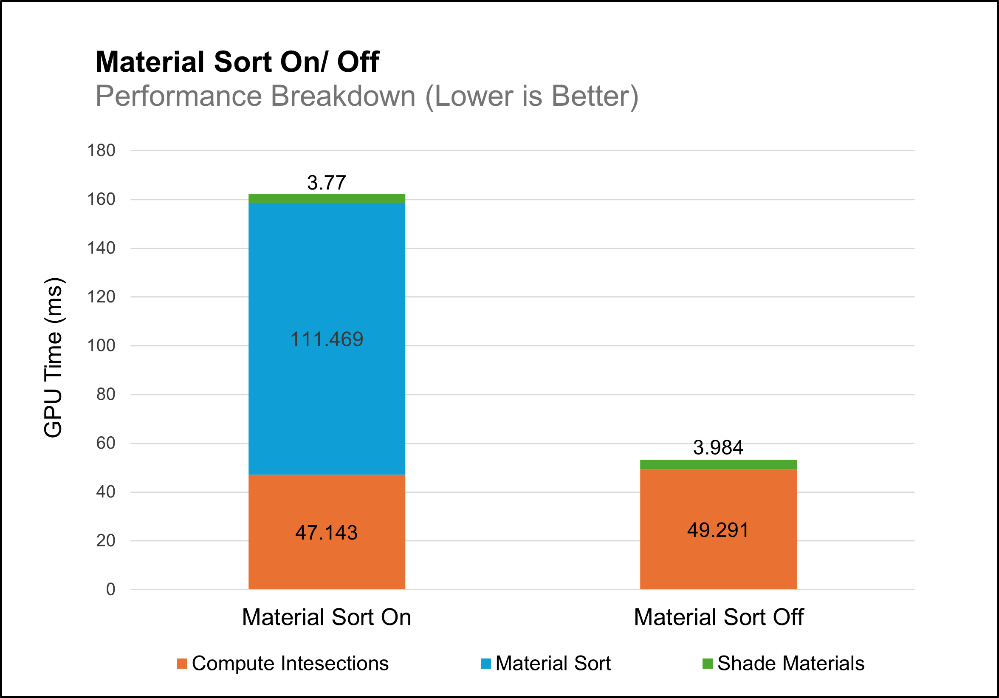</td>
  </tr>
</table>

In reality though, sorting every bounce introduced significant overhead: key generation, `sort_by_key` passes, scanning to find group boundaries, and multiple kernel launches. In our scenes, the benefit from reduced branching wasn’t large enough to offset these costs. The graph below shows this: total time with material sorting exceeded the baseline despite slight wins inside the shading kernels.

The likely culprits are pretty straightforward. With only around eight material buckets, grouping doesn’t buy much; warps still see plenty of variation within a single “material” due to textures, roughness, and IOR differences. On top of that, the per-bounce resorting and relaunching adds a lot of overhead: we’re doing global shuffles of data and paying extra kernel launches at resolutions and paths-per-pixel where those costs dominate. Finally, the memory traffic is nontrivial; reordering zipped arrays (paths, intersections, RNG state, throughput) every bounce is simply expensive.

Still, I think there are scenarios where this approach can help: namely very large scenes with lots of distinct material branches and heavy BSDF divergence. If we go that route, we can consider lighter-weight bucketing/partitioning instead of a full sort (e.g., `thrust::stable_partition` into coarse bins like dielectric, conductor, diffuse) and process those bins sequentially. Binning as a small cascade of partitions, the effective work scales like O(n log M) for M material buckets, whereas a full sort scales like O(n log n) (comparison-based) or O(k n) (radix), so with a small M the binning route often wins. Additionally, we could also reduce churn by sorting less often (every k bounces or after a big drop in active paths).

### BVH
Finally, the most significant optimization for supporting arbitrary, high-poly meshes is a BVH: a Bounding Volume Hierarchy. It’s a tree that partitions scene geometry into nested bounding volumes to avoid testing every triangle for every ray. Without a BVH, naive ray finding is O(n) triangle tests per ray. With a BVH, you traverse a tree and cull whole regions at once. Practical ray cost becomes O(log n) node visits plus intersections with a small set of leaf triangles.

We can see the benefit clearly in the test below:

<table align="center">
  <tr>
    <th>Test Scene</th>
    <th>Test Result</th>
  </tr>
  <tr>
    <td>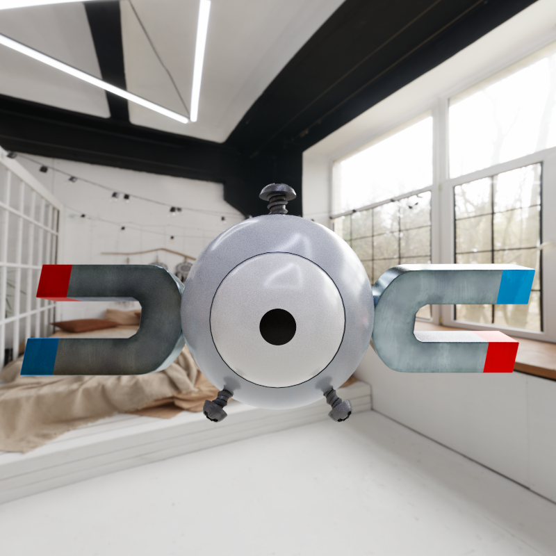</td>
    <td>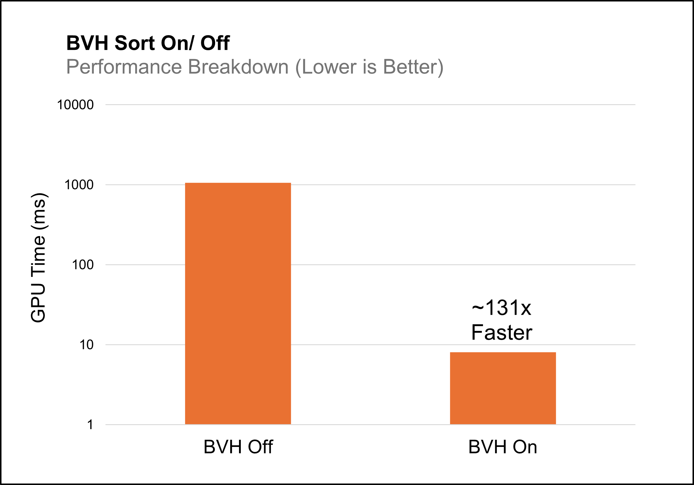</td>
  </tr>
</table>

The model has ~50k triangles. Using a BVH reduced frame time by ~99.3%, about a 131× speedup.

# Credits
## Third Party Code 
- [CIS5650 - GPU Programming and Architecture (Base code)](https://github.com/CIS5650-Fall-2025/Project3-CUDA-Path-Tracer)
- [TinyGltf](https://github.com/syoyo/tinygltf)
- [GLM](https://github.com/g-truc/glm)
- [CUDA Toolkit](https://developer.nvidia.com/cuda-toolkit)
- [NVIDIA OptiX™ AI-Accelerated Denoiser](https://developer.nvidia.com/optix-denoiser)

## 3D Models 
- [The Stanford 3D Scanning Repository](https://graphics.stanford.edu/data/3Dscanrep/)
- [Gizmoduck](https://sketchfab.com/3d-models/gizmoduck-toy-5c4238bd85f645ed84b7bec2b567320c)
- [Crow Toy](https://sketchfab.com/3d-models/crow-toy-c6efada51a1d4721b4bee0bdaabdc276)
- [Mad Android](https://sketchfab.com/3d-models/mad-android-1d932134d0564bd8a9ecf2eb2aec1362)
- [Coffee Tables Three Legs with Rattan I](https://sketchfab.com/3d-models/coffee-tables-three-legs-with-rattan-i-low-poly-c434f22ec51846cc8142e95f7f2495eb)
- [F1 2024 McLaren MCL38](https://sketchfab.com/3d-models/f1-2024-mclaren-mcl38-2950bc595eca43bb86837f25c37ce724)
- [Garage](https://sketchfab.com/3d-models/garage-799ae1192db2468facc347f0f31e1bb8)
- [[Pokémon] Magnemite](https://sketchfab.com/3d-models/pokemon-magnemite-100a13915fd243d0bf35b0c64468984b)
- [Toy Rocketship](https://sketchfab.com/3d-models/toy-rocketship-94000688843242f79a44686d086663b0)
- [Television 01](https://polyhaven.com/a/Television_01)

## HDRIs
- [Brown Photostudio 01](https://polyhaven.com/a/brown_photostudio_01)
- [Fireplace](https://polyhaven.com/a/fireplace) 
- [Christmas Photo Studio 01](https://polyhaven.com/a/christmas_photo_studio_01)
- [Klippad Sunrise 1](https://polyhaven.com/a/klippad_sunrise_1)
- [Studio Small 09](https://polyhaven.com/a/studio_small_09)

